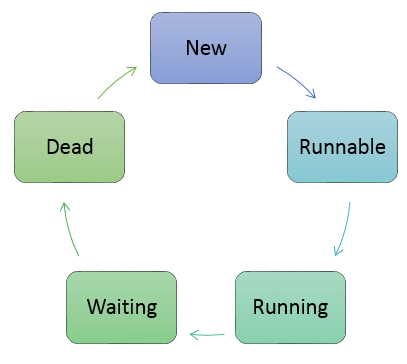
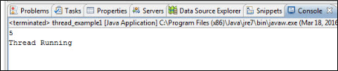
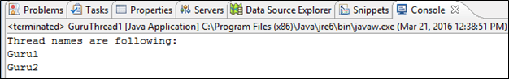
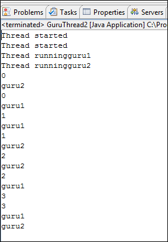

# Where had you used multithreading in Project

## Multithreading in Java Tutorial with Program & Examples

Updated
October 7, 2021

Any application can have multiple processes (instances). Each of this process can be assigned either as a single thread or multiple threads. We will see in this tutorial how to perform multiple tasks at the same time and also learn more about threads and synchronization between threads.
In this Multithreading tutorial in Java, we will learn:


### What is Single Thread?
A single thread in Java is basically a lightweight and the smallest unit of processing. Java uses threads by using a “Thread Class”.

There are two types of thread – user thread and daemon thread (daemon threads are used when we want to clean the application and are used in the background).

When an application first begins, user thread is created. Post that, we can create many user threads and daemon threads.

#### Single Thread Example:
```java
package demotest;

public class GuruThread
{
       public static void main(String[] args) {
              System.out.println("Single Thread");
       }
}
```
#### Advantages of single thread:

1. Reduces overhead in the application as single thread execute in the system
2. Also, it reduces the maintenance cost of the application.
   
### What is Multithreading in Java?
Multithreading in Java is a process of executing two or more threads simultaneously to maximum utilization of CPU. Multithreaded applications execute two or more threads run concurrently. Hence, it is also known as Concurrency in Java. Each thread runs parallel to each other. Mulitple threads don’t allocate separate memory area, hence they save memory. Also, context switching between threads takes less time.

#### Example of Multi thread:
``` java
package demotest;
public class GuruThread1 implements Runnable
{
       public static void main(String[] args) {
        Thread guruThread1 = new Thread("Guru1");
        Thread guruThread2 = new Thread("Guru2");
        guruThread1.start();
        guruThread2.start();
        System.out.println("Thread names are following:");
        System.out.println(guruThread1.getName());
        System.out.println(guruThread2.getName());
    }
    @Override
    public void run() {
    }
}
```
#### Advantages of multithread:

1. The users are not blocked because threads are independent, and we can perform multiple operations at times
2. As such the threads are independent, the other threads won’t get affected if one thread meets an exception.
   
### Thread Life Cycle in Java
The Lifecycle of a thread:




There are various stages of life cycle of thread as shown in above diagram:

1. New
2. Runnable
3. Running
4. Waiting
5. Dead
1. New: In this phase, the thread is created using class “Thread class”.It remains in this state till the program starts the thread. It is also known as born thread.
2. Runnable: In this page, the instance of the thread is invoked with a start method. The thread control is given to scheduler to finish the execution. It depends on the scheduler, whether to run the thread.
3. Running: When the thread starts executing, then the state is changed to “running” state. The scheduler selects one thread from the thread pool, and it starts executing in the application.
4. Waiting: This is the state when a thread has to wait. As there multiple threads are running in the application, there is a need for synchronization between threads. Hence, one thread has to wait, till the other thread gets executed. Therefore, this state is referred as waiting state.
5. Dead: This is the state when the thread is terminated. The thread is in running state and as soon as it completed processing it is in “dead state”.

Some of the commonly used methods for threads are:

Method

Description
#### 1. start()	
This method starts the execution of the thread and JVM calls the run() method on the thread.
#### 2. Sleep(int milliseconds)	
This method makes the thread sleep hence the thread’s execution will pause for milliseconds provided and after that, again the thread starts executing. This help in synchronization of the threads.
#### 3. getName()	
It returns the name of the thread.
#### 4. setPriority(int newpriority)
It changes the priority of the thread.
#### 5. yield ()
It causes current thread on halt and other threads to execute.

#### Example:
In this multithreading program in Java example, we are going to create a thread and explore built-in methods available for threads.

``` java
package demotest;
public class thread_example1 implements Runnable {
    @Override
    public void run() {
    }
    public static void main(String[] args) {
        Thread guruthread1 = new Thread();
        guruthread1.start();
        try {
            guruthread1.sleep(1000);
        } catch (InterruptedException e) {
            // TODO Auto-generated catch block
            e.printStackTrace();
        }
        guruthread1.setPriority(1);
        int gurupriority = guruthread1.getPriority();
        System.out.println(gurupriority);
        System.out.println("Thread Running");
  }
}
```
Explanation of the code:

1. Code Line 2: We are creating a class “thread_Example1” which is implementing the Runnable interface (it should be implemented by any class whose instances are intended to be executed by the thread.)
2. Code Line 4: It overrides run method of the runnable interface as it is mandatory to override that method
3. Code Line 6: Here we have defined the main method in which we will start the execution of the thread.
4. Code Line 7: Here we are creating a new thread name as “guruthread1” by instantiating a new class of thread.
5. Code Line 8: we will use “start” method of the thread using “guruthread1” instance. Here the thread will start executing.
6. Code Line 10: Here we are using the “sleep” method of the thread using “guruthread1” instance. Hence, the thread will sleep for 1000 milliseconds.
7. Code 9-14: Here we have put sleep method in try catch block as there is checked exception which occurs i.e. Interrupted exception.
8. Code Line 15: Here we are setting the priority of the thread to 1 from whichever priority it was
9. Code Line 16: Here we are getting the priority of the thread using getPriority()
10. Code Line 17: Here we are printing the value fetched from getPriority
11. Code Line 18: Here we are writing a text that thread is running.
When you execute the above code, you get the following output:



Thread example in Java

#### Output:

5 is the Thread priority, and Thread Running is the text which is the output of our code.

### Java Thread Synchronization
In multithreading, there is the asynchronous behavior of the programs. If one thread is writing some data and another thread which is reading data at the same time, might create inconsistency in the application.

When there is a need to access the shared resources by two or more threads, then synchronization approach is utilized.

Java has provided synchronized methods to implement synchronized behavior.

In this approach, once the thread reaches inside the synchronized block, then no other thread can call that method on the same object. All threads have to wait till that thread finishes the synchronized block and comes out of that.

In this way, the synchronization helps in a multithreaded application. One thread has to wait till other thread finishes its execution only then the other threads are allowed for execution.

It can be written in the following form:
``` java
Synchronized(object)
{  
        //Block of statements to be synchronized
}
```
### Java Multithreading Example
In this multithreading Java example, we will take two threads and fetch the names of the thread.

#### Example1:


``` java
GuruThread1.java
package demotest;
public class GuruThread1 implements Runnable{

    /**
     * @param args
     */
    public static void main(String[] args) {
        Thread guruThread1 = new Thread("Guru1");
        Thread guruThread2 = new Thread("Guru2");
        guruThread1.start();
        guruThread2.start();
        System.out.println("Thread names are following:");
        System.out.println(guruThread1.getName());
        System.out.println(guruThread2.getName());
    }
    @Override
    public void run() {
    }
}
```
Explanation of the code:

1.  Code Line 3: We have taken a class “GuruThread1” which implements Runnable (it should be implemented by any class whose instances are intended to be executed by the thread.)
2. Code Line 8: This is the main method of the class
3. Code Line 9: Here we are instantiating the Thread class and creating an instance named as “guruThread1” and creating a thread.
4. Code Line 10: Here we are instantiating the Thread class and creating an instance named a “guruThread2” and creating a thread.
5. Code Line 11: We are starting the thread i.e. guruThread1.
6. Code Line 12: We are starting the thread i.e. guruThread2.
7. Code Line 13: Outputting the text as “Thread names are following:”
8. Code Line 14: Getting the name of thread 1 using method getName() of the thread class.
 Code Line 15: Getting the name of thread 2 using method getName() of the thread class.
When you execute the above code, you get the following output:



Java Multithreading Example
#### Output:

Thread names are being outputted here as

* Guru1
* Guru2
#### Example 2:

In this multithreading in Java example, we will learn about overriding methods run() and start() method of a runnable interface and create two threads of that class and run them accordingly.

Also, we are taking two classes,

* One which will implement the runnable interface and
* Another one which will have the main method and execute accordingly.
``` java
package demotest;
public class GuruThread2 {
 public static void main(String[] args) {
  // TODO Auto-generated method stub
  GuruThread3 threadguru1 = new GuruThread3("guru1");
  threadguru1.start();
  GuruThread3 threadguru2 = new GuruThread3("guru2");
  threadguru2.start();
 }
}
class GuruThread3 implements Runnable {
 Thread guruthread;
 private String guruname;
 GuruThread3(String name) {
  guruname = name;
 }
 @Override
 public void run() {
  System.out.println("Thread running" + guruname);
  for (int i = 0; i < 4; i++) {
   System.out.println(i);
   System.out.println(guruname);
   try {
    Thread.sleep(1000);
   } catch (InterruptedException e) {
    System.out.println("Thread has been interrupted");
   }
  }
 }
 public void start() {
  System.out.println("Thread started");
  if (guruthread == null) {
   guruthread = new Thread(this, guruname);
   guruthread.start();
  }
 }
}
```
Explanation of the code:

* Code Line 2: Here we are taking a class “GuruThread2” which will have the main method in it.
* Code Line 4: Here we are taking a main method of the class.
* Code Line 6-7: Here we are creating an instance of class GuruThread3 (which is created in below lines of the code) as “threadguru1” and we are starting the thread.
* Code Line 8-9: Here we are creating another instance of class GuruThread3 (which is created in below lines of the code) as “threadguru2” and we are starting the thread.
* Code Line 11: Here we are creating a class “GuruThread3” which is implementing the runnable interface (it should be implemented by any class whose instances are intended to be executed by the thread.)
* Code Line 13-14: we are taking two class variables from which one is of the type thread class and other of the string class.
* Code Line 15-18: we are overriding the GuruThread3 constructor, which takes one argument as string type (which is threads name) that gets assigned to class variable guruname and hence the name of the thread is stored.
* Code Line 20: Here we are overriding the run() method of the runnable interface.
* Code Line 21: We are outputting the thread name using println statement.
* Code Line 22-31: Here we are using a for loop with counter initialized to 0, and it should not be less than 4 (we can take any number hence here loop will run 4 times) and incrementing the counter. We are printing the thread name and also making the thread sleep for 1000 milliseconds within a try-catch block as sleep method raised checked exception.
* Code Line 33: Here we are overriding start method of the runnable interface.
* Code Line 35: We are outputting the text “Thread started”.
* Code Line 36-40: Here we are taking an if condition to check whether class variable guruthread has value in it or no. If its null then we are creating an instance using thread class which takes the name as a parameter (value for which was assigned in the constructor). After which the thread is started using start() method.
When you execute the above code you get the following output:



Multithreading Example in Java
#### Output:

There are two threads hence, we get two times message “Thread started”.

We get the names of the thread as we have outputted them.

It goes into for loop where we are printing the counter and thread name and counter starts with 0.

The loop executes three times and in between the thread is slept for 1000 milliseconds.

Hence, first, we get guru1 then guru2 then again guru2 because the thread sleeps here for 1000 milliseconds and then next guru1 and again guru1, thread sleeps for 1000 milliseconds, so we get guru2 and then guru1.

### Summary
In this tutorial, we saw multithreaded applications in Java and how to use single and multi thread in Java.

* Explain multithreading in Java: in multithreading, users are not blocked as threads are independent and can perform multiple operations at time
* Various stages of life cycle of the thread are,
* * New
  * Runnable
  * Running
  * Waiting
  * Dead
* We also learned about synchronization between threads, which help the application to run smoothly.
* Multithreaded programming in Java makes many more application tasks easier.

