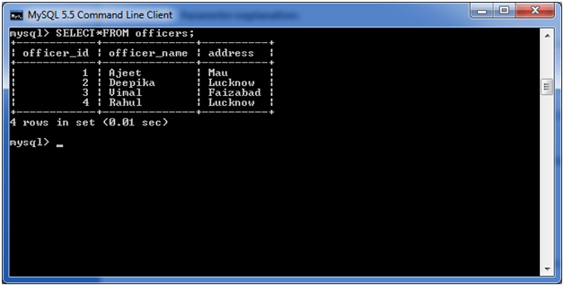
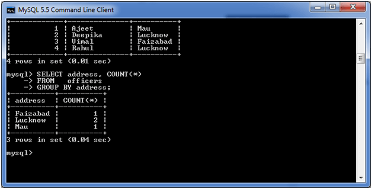
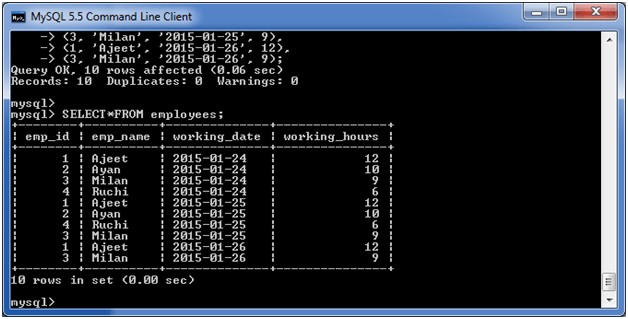
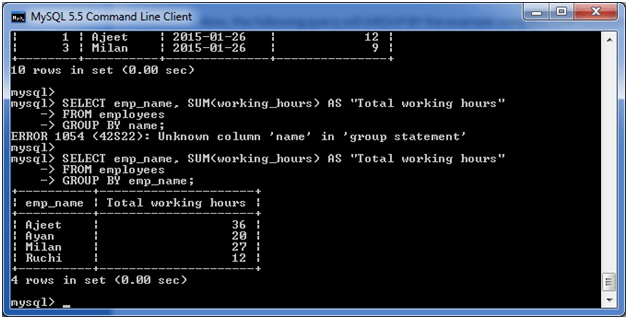
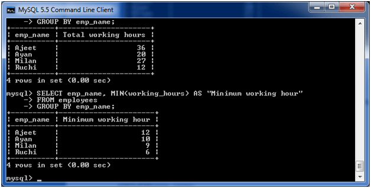
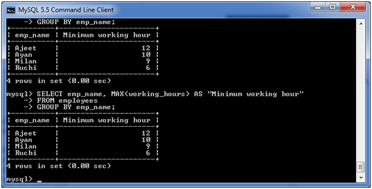
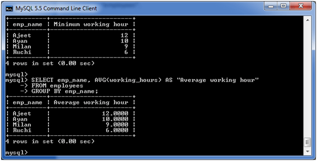

[**Back**](./readme.md)
# intro
MySQL GROUP BY Clause
The MYSQL GROUP BY Clause is used to collect data from multiple records and group the result by one or more column. It is generally used in a SELECT statement.

You can also use some aggregate functions like COUNT, SUM, MIN, MAX, AVG etc. on the grouped column.

Syntax:
``` sql
SELECT expression1, expression2, ... expression_n,   
aggregate_function (expression)  
FROM tables  
[WHERE conditions]  
GROUP BY expression1, expression2, ... expression_n;  
```

## Parameters
expression1, expression2, ... expression_n: It specifies the expressions that are not encapsulated within an aggregate function and must be included in the GROUP BY clause.

aggregate_function: It specifies a function such as SUM, COUNT, MIN, MAX, or AVG etc. tables: It specifies the tables, from where you want to retrieve the records. There must be at least one table listed in the FROM clause.

WHERE conditions: It is optional. It specifies the conditions that must be fulfilled for the records to be selected.

### (i) MySQL GROUP BY Clause with COUNT function
Consider a table named "officers" table, having the following records.

MySQL group by clause 1
Now, let's count repetitive number of cities in the column address.

Execute the following query:

``` sql
SELECT address, COUNT(*)  
FROM   officers   
GROUP BY address;
```   
#### Output:



MySQL group by clause 2
### (ii) MySQL GROUP BY Clause with SUM function
Let's take a table "employees" table, having the following data.


MySQL group by clause 3
Now, the following query will GROUP BY the example using the SUM function and return the emp_name and total working hours of each employee.

Execute the following query:

``` sql
SELECT emp_name, SUM(working_hours) AS "Total working hours"  
FROM employees  
GROUP BY emp_name;  
```
#### Output:



MySQL group by clause 4
### (iii) MySQL GROUP BY Clause with MIN function
The following example specifies the minimum working hours of the employees form the table "employees".

Execute the following query:
``` sql
SELECT emp_name, MIN(working_hours) AS "Minimum working hour"  
FROM employees  
GROUP BY emp_name;  
```
#### Output:



MySQL group by clause 5
### (iv) MySQL GROUP BY Clause with MAX function
The following example specifies the maximum working hours of the employees form the table "employees".

Execute the following query:
``` sql
SELECT emp_name, MAX (working_hours) AS "Minimum working hour"  
FROM employees  
GROUP BY emp_name; 
``` 
#### Output:


MySQL group by clause 6
### (v) MySQL GROUP BY Clause with AVG function
The following example specifies the average working hours of the employees form the table "employees".
Execute the following query:

``` sql
SELECT emp_name, AVG(working_hours) AS "Average working hour"  
FROM employees  
GROUP BY emp_name;
```

#### Output:



